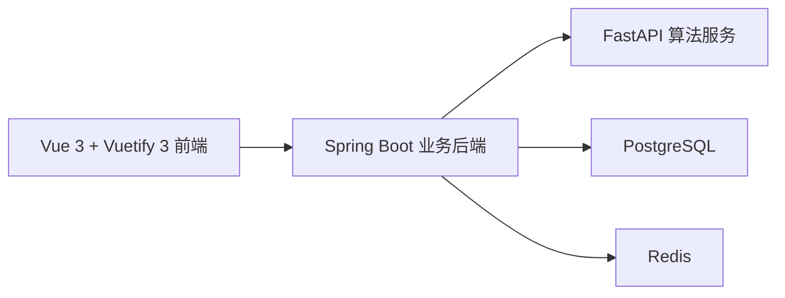

# 件杂货智能配载系统

件杂货智能配载系统是一个面向件杂货船 / 杂货船配载场景的工程化原型项目。系统覆盖船舶、货舱、货物、航次、配载方案、告警和规则模板的基础管理，并通过独立算法服务完成分舱、舱内摆位、重心计算、GM 核算、规则校验以及 PASS / FAIL 判定。

项目采用 monorepo 结构，前后端分离，算法服务独立部署，适合作为生产级原型继续演进。

## 项目亮点

- 前后端分离，算法服务独立，便于后续扩展压载、剪力 / 弯矩、LLM 录单等能力
- 核心公式真实参与计算，不依赖 mock 数据
- 覆盖船舶、货舱、货物、航次、配载方案、告警的完整链路
- 已实现二维总配载图和单舱 3D 检视
- 算法已针对件杂货场景优化为“优先少开舱、优先成舱、优先同层聚拢”
- 支持 Docker 一键运行，适合演示和交付

## 系统架构



系统核心计算链路：

`几何尺寸 -> 单件货物重心 -> 货舱合重心 -> 整船重心 -> KM 插值 -> GM -> 规则校验 -> 合规结论`

## 主要能力

- 船舶管理
- 货舱管理
- 货物管理
- 航次管理
- 配载任务创建与生成
- 方案校验与告警输出
- 整船指标展示：排水量、KG、LCG、TCG、GM、纵向集中指标等
- 二维总配载图展示
- 单舱 3D 摆位检视
- 同规格货物快捷复制

## 技术栈

### 前端

- Vue 3
- TypeScript
- Vite
- Pinia
- Vue Router
- Vuetify 3
- ECharts
- Three.js

### 业务后端

- Java 21
- Spring Boot 3
- Spring Web
- Spring Data JPA
- Spring Validation
- Lombok
- OpenAPI / Swagger

### 算法服务

- Python 3.11
- FastAPI
- Pydantic
- OR-Tools
- NumPy
- pytest

### 基础设施

- PostgreSQL
- Redis
- Nginx
- Docker Compose

## 目录结构

```text
stowage-system
├─ frontend                  # Vue 3 + TS + Vuetify 3 前端
├─ backend                   # Spring Boot 业务后端
├─ algorithm-service         # FastAPI + OR-Tools 算法服务
├─ docs                      # 架构、公式、接口、开发说明
├─ docker                    # Docker Compose 和 Nginx 配置
├─ data                      # 本地运行产生的数据文件
├─ .tools                    # 本机演示脚本与本地工具
├─ start-docker.cmd          # Docker 一键启动
├─ stop-docker.cmd           # Docker 一键停止
└─ README.md
```

## 核心业务对象

- `Ship`
- `Hold`
- `Cargo`
- `Voyage`
- `StowagePlan`
- `StowageItem`
- `RuleTemplate`
- `WarningRecord`
- `ShipHydrostatic`

## 已实现的核心算法能力

- `rotate_dimensions()`：货物朝向旋转后的尺寸计算
- `calculate_cargo_centroid()`：单件货物重心计算
- `check_bounds()`：货物越界检查
- `check_overlap()`：货物碰撞检查
- `calculate_distance_between_boxes()`：包围盒最短距离计算
- `calculate_hold_centroid()`：货舱合重心计算
- `calculate_ship_centroid()`：整船重心计算
- `interpolate_km()`：静水力表 KM 插值
- `calculate_gm()`：GM 计算
- `calculate_hold_utilization()`：舱容利用率与单位舱容载重计算
- `calculate_longitudinal_index()`：纵向集中指标计算
- `evaluate_compliance()`：合规性判定
- `allocate_holds()`：分舱求解
- `pack_hold_items()`：舱内摆位
- `generate_stowage_plan()`：整体方案生成

## 示例数据

项目内置了一套可直接演示的示例数据，包括：

- 1 条件杂货船
- 4 个货舱
- 10+ 件货物
- 1 个示例航次
- 规则模板
- 静水力表数据
- 示例配载方案

初始化 SQL 位于：

`backend/src/main/resources/db/migration/V1__init_schema_and_data.sql`

## 快速开始

### 方式一：Docker 一键运行

这是最推荐的启动方式，适合直接拷贝给别人运行。

1. 安装并启动 Docker Desktop
2. 进入项目根目录
3. 双击运行：

```bat
start-docker.cmd
```

停止服务：

```bat
stop-docker.cmd
```

默认访问地址：

- 系统统一入口：[http://localhost:8088](http://localhost:8088)
- 后端 Swagger：[http://localhost:8080/swagger-ui.html](http://localhost:8080/swagger-ui.html)
- 算法服务 Swagger：[http://localhost:8000/docs](http://localhost:8000/docs)

说明：

- 首次启动会自动由 `.env.example` 生成 `.env`
- Docker 模式默认使用 PostgreSQL + Redis
- 如有端口冲突，可修改根目录 `.env`

### 方式二：本地开发运行

适合本机调试和联调。

#### 1. 启动算法服务

```bash
cd algorithm-service
python -m venv .venv
.venv\Scripts\activate
pip install -e .[dev]
uvicorn app.main:app --reload --host 127.0.0.1 --port 8000
```

#### 2. 启动后端

```bash
cd backend
mvn spring-boot:run
```

#### 3. 启动前端

```bash
cd frontend
npm install
npm run dev
```

常用本地访问地址：

- 前端开发页：[http://127.0.0.1:5174](http://127.0.0.1:5174)
- 后端接口：[http://127.0.0.1:8081](http://127.0.0.1:8081)
- 后端 Swagger：[http://127.0.0.1:8081/swagger-ui.html](http://127.0.0.1:8081/swagger-ui.html)
- 算法服务 Swagger：[http://127.0.0.1:8000/docs](http://127.0.0.1:8000/docs)

## 演示流程

1. 进入“船舶管理”“货物管理”“航次管理”检查基础数据
2. 进入“配载任务”创建或选择方案
3. 选择货物并发起“生成方案”
4. 后端调用算法服务执行分舱、摆位、重心与 GM 核算
5. 在“配载结果”页查看 PASS / FAIL、各舱指标与告警
6. 在“配载可视化”页查看二维总配载图与单舱 3D 检视

## 接口概览

### 后端 REST API

- `GET /api/ships`
- `POST /api/ships`
- `GET /api/ships/{id}/holds`
- `POST /api/ships/{id}/holds`
- `GET /api/cargos`
- `POST /api/cargos`
- `GET /api/voyages`
- `POST /api/voyages`
- `POST /api/plans`
- `GET /api/plans/{id}`
- `POST /api/plans/{id}/generate`
- `POST /api/plans/{id}/validate`

### 算法服务 API

- `POST /api/solver/generate-plan`
- `POST /api/solver/validate-plan`
- `POST /api/solver/cargo-centroid`
- `POST /api/solver/hold-centroid`
- `POST /api/solver/ship-stability`
- `POST /api/solver/rule-check`
- `GET /health`

## 测试

### 算法服务

```bash
cd algorithm-service
pytest
```

### 后端

```bash
cd backend
mvn test
```

### 前端

```bash
cd frontend
npm run test
npm run build
```

## 文档

- [总体架构](./docs/architecture.md)
- [公式说明](./docs/formula.md)
- [接口说明](./docs/api.md)
- [开发备注](./docs/dev-notes.md)
- [项目阶段总结](./docs/project-summary.md)

## 当前状态

当前版本已经形成可运行的 MVP 闭环：

- 前端、后端、算法服务可以联调
- 核心公式已真实参与计算
- 示例数据和示例方案可直接演示
- 可输出 PASS / FAIL 与告警原因
- 已支持二维总配载图与单舱 3D 检视
- 前端界面已迁移为 Material 风格的 `Vuetify 3`

后续重点扩展方向：

- 同票货 / 同卸港优先成块策略
- 压载联动
- 剪力 / 弯矩计算
- 配载图导出 PNG / PDF
- 更完整的后端集成测试与异步任务编排
