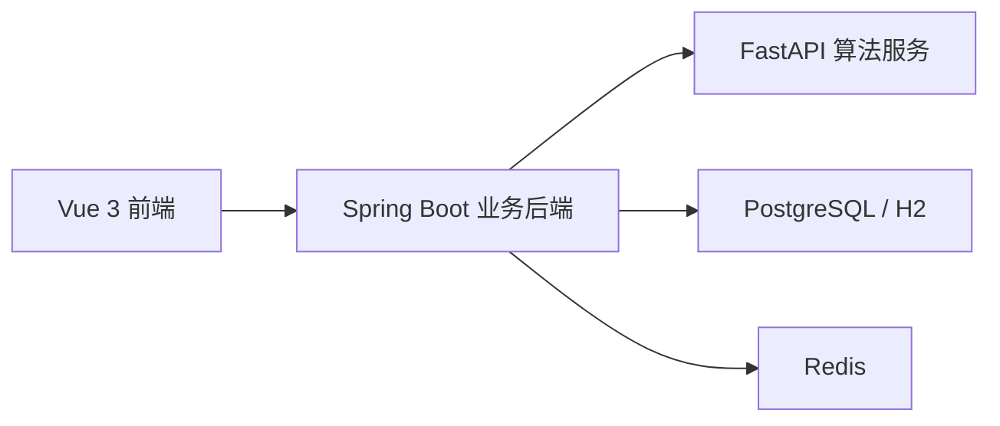

# 件杂货智能配载系统

一个面向件杂货船 / 杂货船的智能配载 MVP 原型。

系统覆盖船舶、货舱、货物、航次、配载方案、告警和规则模板的基础管理，并通过独立算法服务完成分舱、舱内摆位、重心计算、GM 核算、规则校验和 PASS / FAIL 判定，最终以前端二维总配载图、单舱三维视图、图表和明细表格展示结果。

## 项目亮点

- 前后端分离，算法服务独立部署，便于后续扩展
- 核心公式真实参与计算，不是 mock 数据
- 支持船舶、货舱、货物、航次、方案、告警全链路演示
- 已实现二维总配载图和单舱 Three.js 检视视图
- 算法已针对件杂货场景优化为“优先少开舱、同层聚拢、先成舱后开下一舱”
- 提供 Docker 一键运行方式，适合直接交付演示

## 系统架构



配载结果的核心计算链路为：

`几何尺寸 -> 单件重心 -> 货舱合重心 -> 整船重心 -> KM 插值 -> GM -> 规则校验 -> 合规性判定`

## 主要能力

- 船舶管理
- 货舱管理
- 货物管理
- 航次管理
- 配载任务创建与生成
- 方案校验与告警输出
- 整船指标展示：排水量、KG、LCG、TCG、GM、纵向集中指标等
- 二维总配载图展示
- 单舱 3D 摆位检查
- 同款货物快捷复制

## 技术栈

### 前端

- Vue 3
- TypeScript
- Vite
- Pinia
- Vue Router
- Element Plus
- ECharts
- Three.js

### 业务后端

- Java 21
- Spring Boot 3
- Spring Web / WebFlux
- Spring Data JPA
- Spring Validation
- Lombok
- OpenAPI / Swagger

### 算法服务

- Python 3.11
- FastAPI
- Pydantic
- OR-Tools
- NumPy
- pytest

### 基础设施

- PostgreSQL
- Redis
- Nginx
- Docker Compose

## 目录结构

```text
stowage-system
├─ frontend                  # Vue3 + TS 前端
├─ backend                   # Spring Boot 业务后端
├─ algorithm-service         # FastAPI + OR-Tools 算法服务
├─ docs                      # 架构、公式、接口和开发说明
├─ docker                    # Docker Compose 与 Nginx 配置
├─ data                      # 本地运行产生的数据文件
├─ start-docker.cmd          # Docker 一键启动
├─ stop-docker.cmd           # Docker 一键停止
└─ README.md
```

## 已实现的核心业务对象

- `Ship`
- `Hold`
- `Cargo`
- `Voyage`
- `StowagePlan`
- `StowageItem`
- `RuleTemplate`
- `WarningRecord`
- `ShipHydrostatic`

## 已实现的核心算法能力

- 货物旋转尺寸计算 `rotate_dimensions()`
- 单件货物重心计算 `calculate_cargo_centroid()`
- 越界检查 `check_bounds()`
- 货物碰撞检查 `check_overlap()`
- 包围盒距离计算 `calculate_distance_between_boxes()`
- 货舱合重心计算 `calculate_hold_centroid()`
- 整船重心计算 `calculate_ship_centroid()`
- 静水力表 KM 插值 `interpolate_km()`
- GM 计算 `calculate_gm()`
- 舱容比与载重比计算 `calculate_hold_utilization()`
- 纵向集中指标计算 `calculate_longitudinal_index()`
- 合规性判定 `evaluate_compliance()`
- 分舱求解 `allocate_holds()`
- 舱内摆位 `pack_hold_items()`
- 整体方案生成 `generate_stowage_plan()`

## 快速开始

### 方式一：Docker 一键运行

适合直接交付给别人演示。

1. 安装并启动 Docker Desktop
2. 进入项目根目录
3. 执行：

```bat
start-docker.cmd
```

停止服务：

```bat
stop-docker.cmd
```

默认访问地址：

- 系统统一入口：[http://localhost:8088](http://localhost:8088)
- 后端 Swagger：[http://localhost:8080/swagger-ui.html](http://localhost:8080/swagger-ui.html)
- 算法服务 Swagger：[http://localhost:8000/docs](http://localhost:8000/docs)

说明：

- 首次运行会自动从 `.env.example` 生成 `.env`
- Docker 模式默认使用 PostgreSQL + Redis
- 如果端口冲突，可修改 `.env`

### 方式二：本地开发运行

适合本机调试。

#### 1. 启动算法服务

```bash
cd algorithm-service
python -m venv .venv
.venv\Scripts\activate
pip install -e .[dev]
uvicorn app.main:app --reload --port 8000
```

#### 2. 启动业务后端

```bash
cd backend
mvn spring-boot:run
```

#### 3. 启动前端

```bash
cd frontend
npm install
npm run dev
```

当前本地联调默认端口为：

- 前端：[http://127.0.0.1:5174](http://127.0.0.1:5174)
- 后端：[http://127.0.0.1:8081](http://127.0.0.1:8081)
- 算法服务：[http://127.0.0.1:8000](http://127.0.0.1:8000)

## 示例数据

系统内置一套可直接演示的示例数据，包括：

- 1 条件杂货船
- 4 个货舱
- 10+ 件货物
- 1 个航次
- 规则模板
- 静水力表数据
- 示例配载方案

数据库初始化 SQL 位于：

`backend/src/main/resources/db/migration/V1__init_schema_and_data.sql`

## 演示流程

1. 进入“船舶管理”“货物管理”“航次管理”检查基础数据
2. 进入“配载任务”创建或选择方案
3. 选择货物并发起“生成方案”
4. 后端调用算法服务执行分舱、摆位、GM 与规则核算
5. 在“配载结果”页查看 PASS / FAIL、各舱指标与告警
6. 在“配载可视化”页查看二维总配载图与单舱三维视图

## 访问接口

### 后端 REST API

- `GET /api/ships`
- `POST /api/ships`
- `GET /api/ships/{id}/holds`
- `POST /api/ships/{id}/holds`
- `GET /api/cargos`
- `POST /api/cargos`
- `GET /api/voyages`
- `POST /api/voyages`
- `POST /api/plans`
- `GET /api/plans/{id}`
- `POST /api/plans/{id}/generate`
- `POST /api/plans/{id}/validate`

### 算法服务 API

- `POST /api/solver/generate-plan`
- `POST /api/solver/validate-plan`
- `POST /api/solver/cargo-centroid`
- `POST /api/solver/hold-centroid`
- `POST /api/solver/ship-stability`
- `POST /api/solver/rule-check`
- `GET /health`

## 测试

### 算法服务

```bash
cd algorithm-service
pytest
```

### 后端

```bash
cd backend
mvn test
```

### 前端

```bash
cd frontend
npm run test
npm run build
```

## 文档

- [总体架构](./docs/architecture.md)
- [公式说明](./docs/formula.md)
- [接口说明](./docs/api.md)
- [开发备注](./docs/dev-notes.md)
- [项目阶段总结](./docs/project-summary.md)

## 当前状态

当前版本已经形成完整 MVP 闭环：

- 前端、后端、算法服务已联调打通
- 核心公式已真实参与计算
- 示例数据和示例方案可直接演示
- 可输出 PASS / FAIL 与告警原因
- 可展示二维总配载图与单舱 3D 视图

后续重点扩展方向：

- 同票货 / 同卸港优先成块策略
- 压载联动
- 剪力 / 弯矩计算
- 配载图导出 PNG / PDF
- 更完整的后端集成测试与任务编排
